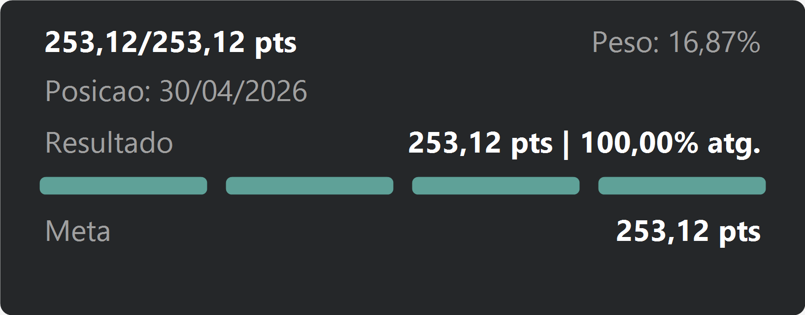

# Progresso Índice — Visual Personalizado para Power BI


Cartão de **progresso por barras** para Power BI, distribuído como **visual personalizado importável** (`.pbiviz`). É a reconstrução nativa de um cartão que originalmente era gerado por **DAX + SVG** dentro de um componente *HTML Content*.



---

## Índice

- [Conceito e motivação](#conceito-e-motivação)
- [Anatomia do visual](#anatomia-do-visual)
- [Campos (painel de Dados)](#campos-painel-de-dados)
- [Opções de formatação](#opções-de-formatação)
- [Como a barra funciona](#como-a-barra-funciona)
- [De-para com o DAX original](#de-para-com-o-dax-original)
- [Arquitetura do projeto](#arquitetura-do-projeto)
- [Pré-requisitos](#pré-requisitos)
- [Build e empacotamento](#build-e-empacotamento)
- [Instalação no Power BI Desktop](#instalação-no-power-bi-desktop)
- [Tecnologias](#tecnologias)
- [Limitações e roadmap](#limitações-e-roadmap)
- [Licença](#licença)
- [Autor](#autor)

---

## Conceito e motivação

A solução anterior calculava todo o cartão em **DAX**, montando uma string **SVG** que era renderizada por um visual de mercado do tipo *HTML Content*. Essa abordagem funciona e entrega exatamente o resultado desejado, porém tem custos:

| Aspecto | DAX + SVG (HTML Content) | Visual personalizado (este projeto) |
| --- | --- | --- |
| Consumo de recursos | Alto (string SVG recalculada a cada interação) | Baixo (render nativo em TypeScript) |
| Dicas de ferramenta (tooltips) | Não disponíveis | **Suportadas** (poço dedicado) |
| Configuração pelo usuário | Hard-coded no DAX | **Painel de formatação nativo** |
| Reuso entre relatórios | Copiar/colar a medida | Importar um `.pbiviz` |
| Manutenção | Editar DAX longo | Campos + propriedades |

O objetivo deste visual é **manter 100% de fidelidade ao layout original**, mas movendo cálculo e estilo para a camada certa: medidas no painel de Dados e estilo no painel de Formatação.

---

## Anatomia do visual

```
┌─────────────────────────────────────────────────────────────┐
│  253,12/253,12 pts                            Peso: 16,87%    │  ← Campo 1 (esq.) / Campo 2 (dir.)
│  Posição: 30/04/2026                                          │  ← Posição
│                                                               │
│  Resultado                       253,12 pts | 100,00% atg.    │  ← rótulo / Campo 3
│  ▰▰▰▰▰▰   ▰▰▰▰▰▰   ▰▰▰▰▰▰   ▰▰▰▰▰▰                            │  ← Campo 4 (barra)
│  Meta                                          253,12 pts     │  ← rótulo / Campo 5
└─────────────────────────────────────────────────────────────┘
```

O visual é desenhado em um `viewBox` fixo de `817 × 321`, com `preserveAspectRatio`, então escala proporcionalmente ao tamanho do contêiner mantendo o layout.

---

## Campos (painel de Dados)

Cada valor distinto do cartão é um campo independente, aceitando uma medida (ou coluna):

| Campo | Nome interno | Onde aparece |
| --- | --- | --- |
| Campo 1 — Resultado (topo) | `resultadoTopo` | Cabeçalho, antes da `/` |
| Campo 1 — Meta (topo) | `metaTopo` | Cabeçalho, depois da `/` |
| Campo 2 — Peso | `peso` | Cabeçalho à direita (`Peso: %`) |
| Posição (data) | `posicao` | Linha `Posição:` |
| Campo 3 — Resultado (barra) | `resultadoBarra` | Acima da barra, à direita (`X pts \| ...`) |
| Campo 3 — Atingimento % | `atingimento` | Acima da barra (`... Y% atg.`) |
| Campo 4 — Progresso da barra % | `progresso` | Preenchimento dos segmentos |
| Campo 5 — Meta (barra) | `metaBarra` | Abaixo da barra, à direita |
| Dicas de ferramenta | `tooltips` | Tooltip ao passar o mouse |

> **Percentuais**: por padrão o visual interpreta `peso`, `atingimento` e `progresso` como **fração** (ex.: `0,1687` → `16,87%`), igual ao DAX original. Caso suas medidas já venham multiplicadas por 100, desligue *"Percentuais como fração (0 a 1)"* no cartão **Números**.

---

## Opções de formatação

Todas no painel nativo de Formatação:

| Cartão | Principais opções |
| --- | --- |
| **Cartão (fundo)** | Cor de fundo, arredondamento das bordas |
| **Campo 1 — Resultado/Meta** | Fonte, tamanho, negrito, cor, prefixo (rótulo), separador, sufixo |
| **Campo 2 — Peso** | Rótulo, fonte, tamanho, negrito, cor |
| **Posição (data)** | Rótulo, fonte, tamanho, negrito, cor |
| **Campo 3 — Resultado/Atingimento** | Rótulo + cor do rótulo, fonte/tamanho/negrito, cor do valor, textos intermediário e final |
| **Campo 4 — Barra de progresso** | Cor (atingido), cor (abaixo da meta), cor de fundo da barra, limite (%), nº de segmentos, altura |
| **Campo 5 — Meta** | Rótulo + cor do rótulo, fonte/tamanho/negrito, cor do valor, sufixo |
| **Números (formatação)** | Casas decimais, vírgula como separador decimal, percentuais como fração |

---

## Como a barra funciona

A barra reproduz fielmente a lógica do DAX original: **N segmentos** (4 por padrão), cada um representando uma fatia igual do progresso (`1 / N`, ou seja 25% cada quando `N = 4`).

Para o progresso `p` (em fração) e segmento `i` (começando em 0):

```
banda      = 1 / N
preenchido = clamp(0, (p - i * banda) / banda, 1) * larguraSegmento
```

A **cor** é dinâmica: se `p >= limite/100`, usa a *cor de atingido* (verde `#5FA198`); caso contrário, a *cor de não-atingido* (vermelho `#D2666A`). O limite padrão é `100%`. A largura total da barra é mantida constante (`737` no `viewBox`), recalculando a largura de cada segmento conforme o número escolhido.

---

## De-para com o DAX original

| Variável no DAX | Significado | Campo no visual |
| --- | --- | --- |
| `_Resultado` (`Pontual_Real_Mensal`) | Resultado do cabeçalho | Campo 1 — Resultado (topo) |
| `_Meta` (`253,12`) | Meta do cabeçalho | Campo 1 — Meta (topo) |
| `_Peso` (`0,1687`) | Peso do indicador | Campo 2 — Peso |
| `_DataPos` | Data de posição | Posição (data) |
| `_Pontos` (`Realizado`) | Resultado da barra | Campo 3 — Resultado (barra) |
| `_Percentual` (`_Pontos / _MetaTexto`) | Atingimento | Campo 3 — Atingimento % **e** Campo 4 — Progresso |
| `_MetaTexto` (`Meta_Projecao`) | Meta projetada | Campo 5 — Meta (barra) |
| `_CorBarra` (verde/vermelho) | Cor condicional | Cartão **Barra** (cores + limite) |

> Agora cada uma dessas variáveis vira uma **medida simples** arrastada para o campo correspondente — sem precisar montar a string SVG no DAX.

---

## Arquitetura do projeto

```
.
├── pbiviz.json            # Metadados do visual (nome, guid, autor, ícone)
├── capabilities.json      # Campos (data roles), mapeamento de dados, objetos de formatação, tooltips
├── package.json           # Dependências e scripts
├── tsconfig.json          # Configuração do TypeScript
├── assets/
│   └── icon.png           # Ícone do visual (20×20)
├── style/
│   └── visual.less        # Estilo do contêiner
├── docs/
│   └── preview.png        # Imagem de demonstração
└── src/
    ├── settings.ts        # Painel de formatação (formatting model moderno)
    └── visual.ts          # Lógica de renderização do SVG + tooltips
```

**Fluxo de dados e renderização:**

1. `capabilities.json` declara os campos (data roles) e mapeia os dados como uma **tabela** (`dataViewMappings.table`).
2. No `update()`, `visual.ts` lê a primeira/última linha da tabela e resolve cada valor pelo papel (`role`) da coluna.
3. As preferências do usuário são lidas via **formatting model** (`settings.ts` + `FormattingSettingsService`).
4. O `render()` monta o SVG (fundo, textos e segmentos da barra) com `createElementNS`, aplicando fontes, cores e formatação numérica (pt-BR).
5. `getFormattingModel()` constrói o painel de formatação nativo.
6. Eventos de mouse no SVG acionam o `tooltipService` com os campos do poço **Dicas de ferramenta**.

---

## Pré-requisitos

- [Node.js](https://nodejs.org) LTS (testado com **v24**).
- `powerbi-visuals-tools` (instalado como dependência de desenvolvimento via `npm install`).

---

## Build e empacotamento

```bash
# 1. Instalar dependências
npm install

# 2. Gerar o pacote .pbiviz
npm run package
# (equivale a: npx pbiviz package)
```

O arquivo final é gerado em `dist/progressoIndiceBarras<guid>.<versão>.pbiviz`.

Para desenvolvimento com recarga ao vivo no *Power BI Service* (requer certificado de dev):

```bash
npm start   # npx pbiviz start
```

> Em alguns ambientes Windows, o `pbiviz` exibe um aviso ao gerar o certificado (`pwsh não reconhecido`). Isso afeta **apenas** o modo `start`; o `package` funciona normalmente.

---

## Instalação no Power BI Desktop

1. Painel **Visualizações → ⋯ (Obter mais visuais) → Importar um visual de um arquivo**.
2. Selecione o arquivo `.pbiviz` gerado em `dist/`.
3. Adicione o visual ao relatório e arraste suas medidas para os campos correspondentes.
4. Ajuste a aparência no painel de **Formatação**.

---

## Tecnologias

- [Power BI Visuals API](https://learn.microsoft.com/power-bi/developer/visuals/) `5.9.0`
- [powerbi-visuals-tools (pbiviz)](https://www.npmjs.com/package/powerbi-visuals-tools) `5.6.0`
- [powerbi-visuals-utils-formattingmodel](https://www.npmjs.com/package/powerbi-visuals-utils-formattingmodel) `6.0.4`
- TypeScript `5.6` · SVG (DOM nativo) · Less

---

## Limitações e roadmap

- O visual exibe um **único conjunto de valores** por instância (cartão), seguindo o desenho original.
- Recursos opcionais ainda não implementados: seleção cruzada (*highlight*), menu de contexto, alto contraste, navegação por teclado, página inicial e localização.
- Possíveis evoluções: rótulo de porcentagem dentro da barra, animação de preenchimento e temas pré-configurados.

---

## Licença

Distribuído sob a licença **MIT**. Veja [LICENSE](LICENSE).

---

## Autor

**Rodrigo de Souza Barbosa** · rodzbar@outlook.com
